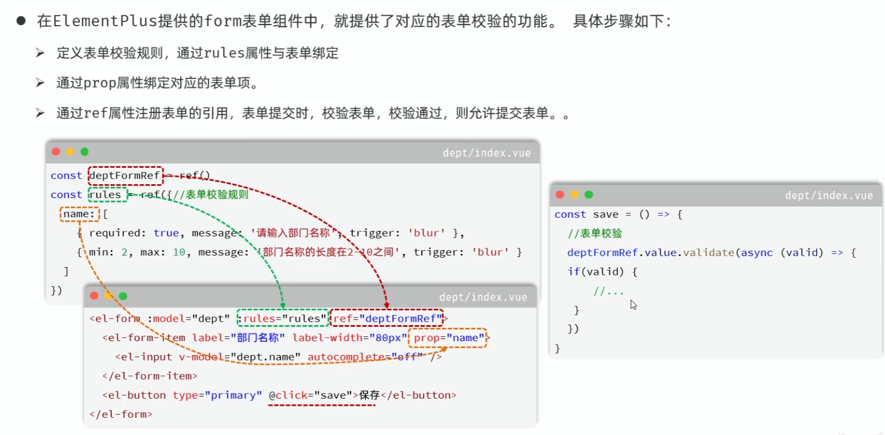

官网：https://element-plus.org/zh-CN/

准备工作：

1.创建vue项目

2.安装element plus组件库：npm install elemenet-plus@2.4.4 --save

3.main.js中引入element plus组件库（官方文档）

```vue
main.js//引入ElementPlus
import ElementPlus from 'element-plus'
import 'element-plus/ist/index.css'

createApp(App).use(ElementPlus).mount('#app')
```

```vue
main.js//引用中文语言包
import zhCn from 'element-plus/es/locale/lang/zh-cn'

createApp(App).use(ElementPlus,{ locale: zhCn}).mount('#app')


```

### 表单校验


