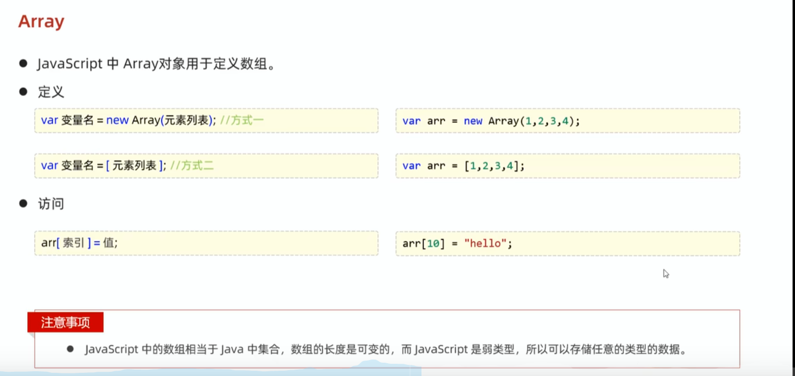
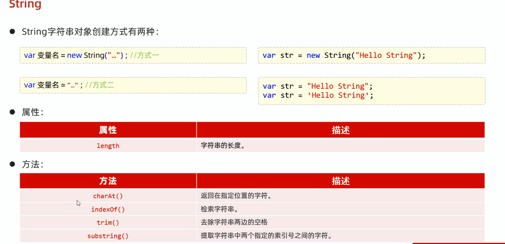
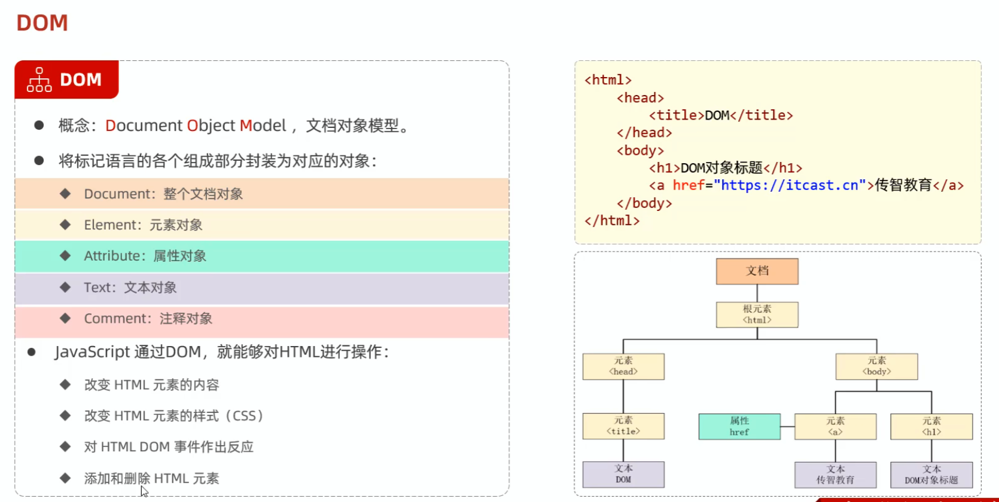
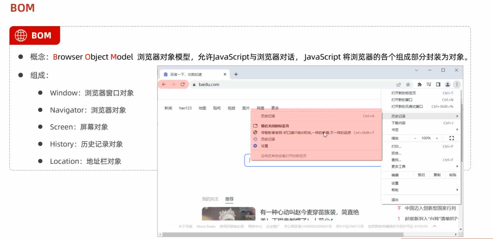
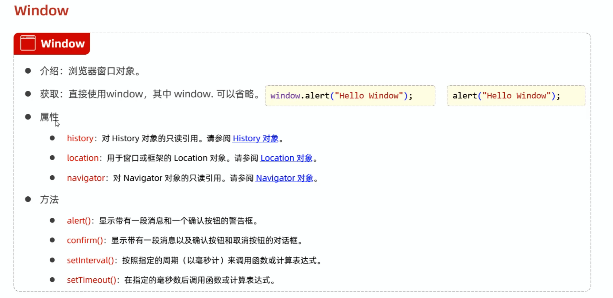

# 前端开发完整笔记

> 从浏览器基础到 Vue 工程化，按“页面结构 → 编程能力 → 组件化 → 工程实践”的顺序组织。阅读时先理解原理，再运行示例，最后完成练习。

| 项目 | 说明 |
| --- | --- |
| 难度 | 入门到进阶 |
| 适合读者 | 需要系统学习 HTML、CSS、JavaScript、Vue 与 Element Plus 的开发者 |
| 原始资料 | 3 份分散笔记，已合并并保留到 `notes-archive/legacy-docs/` |

## 阅读目录

1. [学习目标](#学习目标)
2. [知识地图](#知识地图)
3. [核心内容](#核心内容)
4. [综合示例](#综合示例)
5. [常见误区](#常见误区)
6. [练习题](#练习题)
7. [参考答案](#参考答案)
8. [复习清单](#复习清单)

## 学习目标

- 掌握 HTML 语义、CSS 盒模型与常用布局
- 理解 JavaScript 数据、函数、DOM、异步请求
- 能够创建 Vue 工程并组织组件、路由和状态
- 能够使用 Element Plus 完成表单校验与常见页面

## 知识地图

1. HTML / CSS：页面结构与视觉布局
2. JavaScript：数据、行为与浏览器 API
3. Vue：响应式、组件、路由与工程化
4. Element Plus：业务组件与表单规范

## 核心内容


### HTML、CSS 与 JavaScript 基础

#### 前端总笔记

#### 快速入口

- HTML / CSS：标签、选择器、布局、表单、表格、盒模型
- JavaScript：语法、变量、类型、函数、数组、字符串、JSON、DOM、BOM、Ajax/Axios
- Vue：工程化、API 风格、路由、常用指令、生命周期
- Element Plus：安装与表单校验

#### HTML / CSS（图片笔记整理）

##### 样式与选择器


##### 颜色表示


##### 布局与盒模型


##### 表单与表格


#### JavaScript（图片笔记整理）

##### 介绍与引入方式


##### 书写语法与输出语句


##### 变量与数据类型


##### 运算符


##### 函数


##### 数组与字符串




##### JSON


##### DOM




##### BOM




##### Ajax / Axios

1.引用Axios的js文件
    <scrpit src = "js/axios-0.18.0.js"></script>

2.使用Axios发送请求，并获取相应结果
    axios({
        method:"get",

})

需要提前将官方的Axios的js文件放到js中


Axios 入门摘录：

```html
<script src="js/axios-0.18.0.js"></script>
```

```js
axios({
  method: "get"
})
```

原笔记位置：`前端/javaScript/img/Ajax/Axios/入门.md`

#### Vue（图片 + 工程化笔记）

##### Vue 工程化（create-vue / 结构 / Router 等）

建议先看这篇完整笔记：

- Vue 工程化：见下文“Vue 工程化与应用开发”

这里把常用图片入口也聚合在一起：


##### API 风格


##### 路由


##### watch 与代理


##### 常用指令与生命周期（Vue2/入门阶段）


原笔记位置：`前端/javaScript/img/VUE/常用指令.md`

#### Element Plus

组件库入口：

- Element Plus：见下文“Element Plus 表单实践”

表单校验：


---

### Vue 工程化与应用开发

#### 简介

##### 工程化

模块化：项目划分若干模块，单独开发、维护、提高效率

组件化：将页面的各个组件部分封装为一个一个的组件，提高复用

规范发：提供标准统一的目录结构、编码规范、开发流程

自动化：项目的构建、开发、测试、打包、部署

##### create-vue

官方提供的最新的脚手架工具，用于快速生成一个工程化的Vue项目

**create-vue提供的功能如下：**

​	统一的目录结构

​	本地部署

​	热部署

​	单元测试

​	集成打包上线

**依赖环境**：NodeJS

##### NodeJS

**1). 验证NodeJS的环境变量**

NodeJS 安装完毕后，会自动配置好环境变量，我们验证一下是否安装成功，通过： `node -v`

**2). 配置npm的全局安装路径**

使用 **管理员身份** 运行命令行，在命令行中，执行如下指令：

```Java
npm config set prefix "D:\develop\NodeJS"
```

**注意：D:\develop\NodeJS 这个目录是NodeJS的安装目录 。**

**注意：D:\develop\NodeJS 这个目录是NodeJS的安装目录 。**

**注意：D:\develop\NodeJS 这个目录是NodeJS的安装目录 。**

**3). 切换为淘宝镜像，加速下载：**

```Java
npm config set registry https://registry.npmmirror.com
```

------

#### Vue项目——创建

@后面是版本号，没添加默认是最新的。


##### 项目结构


启动


------

#### API风格

##### 选项式API

可以用包含多个选项的对象来描述组件的逻辑，如：data，methods，mounted等。选项定义的属性都会暴露在函数内部的this上，它会指向当前的组件实例。


##### 组合式API

是Vue3提供的一种基于函数的组件编写方式，通过使用函数来组织和复用组件的逻辑。它提供了一种更灵活，更可组合的方式来编写组件。

在Vue中的组合式API使用时，是没有this对象的，this对象是undefined。


```vue
<script setup>//setup预处理操作，高偶素Vue需要进行一些处理，让我们更简洁的使用组合式API
//引入ref函数，接受一个内部值，返回一个响应式的ref对象，此对象只有一个指向内部值的属性value。
import {ref, onMounted} from 'vue';

//定义一个响应式变量
const count = ref(0);

//定义一个函数，用于增加count的值
function increment(){
    count.value++;
}

//钩子函数，注册一个回调函数，在组件挂载完成后执行。
onMounted(()=>{
    console.log('组件挂载完成');
})
</script>

<template>
    <button @click="increment">count:{{count}}</button>
</template>

<style scoped>/* scoped表示样式只作用于当前组件 */


</style>

```

------

#### Router

组成：

​	Router实例：路由实例，基于createRouter函数创建，维护了应用的路由信息。

​	<router-link>:路由链接组件，浏览器会解析成<a>。

​	<router-view>:动态视图组件，用来渲染展示与路由路径对应的组件。


```js
//router/index.js
import { createRouter, createWebHistory } from 'vue-router'

const router = createRouter({
  history: createWebHistory(),
  routes: [
    // {
    //   path: '/',
    //   name: 'home',
    //   component: HomeView
    // },
    // {
    //   path: '/about',
    //   name: 'about',
    //   component: () => import('../views/AboutView.vue')
    // }
  ]
})

export default router

```

```vue
//index.vue
<!-- 首页菜单 -->
<router-link to="/index">
  <el-menu-item index="/index">
    <el-icon><Promotion /></el-icon> 首页
  </el-menu-item>
</router-link>
```

如果用el-menu组件则可以不用这种方式，直接启用vue-router模式通过index跳转。

##### **1.实例**

```vue
        <!-- 左侧菜单栏 -->
<el-menu router="true">
  <!-- 首页菜单 -->
  <el-menu-item index="/index">
    <el-icon><Promotion /></el-icon> 首页
  </el-menu-item>

  <!-- 班级管理菜单 -->
  <el-sub-menu index="/manage">
    <template #title>
      <el-icon><School /></el-icon>班级学员管理
    </template>
    <el-menu-item index="/clazz">
      <el-icon><HomeFilled /></el-icon>班级管理
    </el-menu-item>
    <el-menu-item index="/stu">
      <el-icon><UserFilled /></el-icon>学员管理
    </el-menu-item>
  </el-sub-menu>

  <!-- 系统信息管理 -->
  <el-sub-menu index="/system">
    <template #title>
      <el-icon><Tools /></el-icon>系统信息管理
    </template>
    <el-menu-item index="/dept">
      <el-icon><HelpFilled /></el-icon>部门管理
    </el-menu-item>
    <el-menu-item index="/emp">
      <el-icon><Avatar /></el-icon>员工管理
    </el-menu-item>
  </el-sub-menu>

  <!-- 数据统计管理 -->
  <el-sub-menu index="/report">
    <template #title>
      <el-icon><Histogram /></el-icon>数据统计管理
    </template>
    <el-menu-item index="/empReport">
      <el-icon><InfoFilled /></el-icon>员工信息统计
    </el-menu-item>
    <el-menu-item index="/stuReport">
      <el-icon><Share /></el-icon>学员信息统计
    </el-menu-item>
    <el-menu-item index="/log">
      <el-icon><Document /></el-icon>日志信息统计
    </el-menu-item>
  </el-sub-menu>
</el-menu>
```

inde.js的路由配置路径

##### **2.路由链接组件**

```js
import { createRouter, createWebHistory } from 'vue-router'

import IndexView from '@/views/index/index.vue'
import ClazzView from '@/views/clazz/index.vue'
import DeptView from '@/views/dept/index.vue'
import EmpView from '@/views/emp/index.vue'
import LayoutView from '@/views/layout/index.vue'
import LogView from '@/views/log/index.vue'
import EmpReportView from '@/views/report/emp/index.vue'
import StuReportView from '@/views/report/stu/index.vue'
import StuView from '@/views/stu/index.vue'
import LoginView from '@/views/login/index.vue'


const router = createRouter({
  history: createWebHistory(),
  routes: [
    {path: '/index',name: 'index',component: IndexView},
    {path: '/clazz',name: 'clazz',component: ClazzView},
    {path: '/dept',name: 'dept',component: DeptView},
    {path: '/emp',name: 'emp',component: EmpView},
    {path: '/layout',name: 'layout',component: LayoutView},
    {path: '/log',name: 'log',component: LogView},
    {path: '/empReport',name: 'empReport',component: EmpReportView},
    {path: '/stuReport',name: 'stuReport',component: StuReportView},
    {path: '/stu',name: 'stu',component: StuView},
    {path: '/login',name: 'login',component: LoginView},
  ]
})

export default router

```

##### 3.动态视图组件

```vue
<el-main>
        <router-view></router-view>
</el-main>
```

------

##### **嵌套路由**

```js
const router = createRouter({
  history: createWebHistory(),
  routes: [
    {path: '/',
    name: '',
    component: LayoutView,
    redirect: '/index',
    children: [
    {path: '/index',name: 'index',component: IndexView},
    {path: '/clazz',name: 'clazz',component: ClazzView},
    {path: '/dept',name: 'dept',component: DeptView},
    {path: '/emp',name: 'emp',component: EmpView},
    {path: '/log',name: 'log',component: LogView},
    {path: '/empReport',name: 'empReport',component: EmpReportView},
    {path: '/stuReport',name: 'stuReport',component: StuReportView},
    {path: '/stu',name: 'stu',component: StuView},]
  },
    {path: '/login',name: 'login',component: LoginView}
]

})
```

**children**相当于一个数组，存储**子组件**，先判断/根组件，如果后面没有路径则会是**redirect重定向的路径**，如果为子组件的路径，则会路由在基础的**根路径**的组件中显示继续路由，如果为**/login**则不会在该**layout**路径中显示。


------

#### 程序优化

通过定义一个请求处理的工具类将请求的路径统一处理，根据定义的request.js。

```js
import axios from 'axios'

//创建axios实例对象
const request = axios.create({
  baseURL: 'http://localhost:8080',
  timeout: 600000
})

//axios的响应 response 拦截器
request.interceptors.response.use(
  (response) => { //成功回调
    return response.data
  },
  (error) => { //失败回调
    return Promise.reject(error)
  }
)

export default request
```

与服务端进行异步交互的逻辑，通常会封装到一个单独的api中，如：dept.js。

```js
import request from '@/utils/request';


//查询全部部门数据
export function queryAllApi() { return request.get('/depts'
)}
```

```vue
import {queryAllApi} from '@/api/dept'
//查询
const search = async () =>{
  const result = await queryAllApi();
  deptList.value = result.data;
}

const deptList = ref([])
```

##### 反向代理服务器


```js
erver: {
    proxy: {
      '/api': {
        target: 'http://localhost:8080',
        changeOrigin: true,
        rewrite: (path) => path.replace(/^\/api/, '')//将api替换为空串
      }
    }
  }
```

------

#### Watch侦听

作用：侦听一个或多个响应式数据源，并在数据源变化时调用传入的回调函数。

用法：

​	导入watch函数

​	执行watch函数，传入要侦听的响应式数据源（ref对象）和回调函数；


一旦a发生变化就执行后面的函数，newVal存储的新值，oldVal存入的旧值

深度侦听：在最后加,{deep:true}：是否侦听该对象所有属性的改变

立即侦听：immediate(boolean)：是否在侦听创建时立即触发回调函数

侦听单个属性：指定响应式对象其中一个属性的值

------

#### 登录校验


携带令牌范围跟服务端


<script>
    new Vue({
        el:"#id",
        data:{
            url = "www.baidu.com"
            age :65
            addres:["1",“2”,“3”]
        },
    })
</script>


data:

1.v-bind 添加绑定属性

​	<a v-bind:href="url"></a>
​	<a :href="url"></a>

2.v-model 在表单元素上创建双向数据绑定

​	<input type = "text" v-model="url"></input>

条件渲染：

3.v-if /v-else-if / v-else 如果判定为true就渲染，否则不渲染

<span v-if = "age <= 35">young</span>
<span v-else-if = "age >= 35 && age <= 60">mid-old</span>
<span v-else >young</span>

4.v-show 如果判定不为true，仍会渲染，要设置css格式的display属性的值来设置是否显示

5.v-for 列表渲染，遍历容器的元素或者对象的属性

<div v-for = "addr in addres">({addr})</div>
<div v-for ="(addr,index) in addres" >
    ({index}),({addr})
</div>

---

### Element Plus 表单实践

官网：https://element-plus.org/zh-CN/

准备工作：

1.创建vue项目

2.安装element plus组件库：npm install elemenet-plus@2.4.4 --save

3.main.js中引入element plus组件库（官方文档）

```vue
main.js//引入ElementPlus
import ElementPlus from 'element-plus'
import 'element-plus/ist/index.css'

createApp(App).use(ElementPlus).mount('#app')
```

```vue
main.js//引用中文语言包
import zhCn from 'element-plus/es/locale/lang/zh-cn'

createApp(App).use(ElementPlus,{ locale: zhCn}).mount('#app')


```

#### 表单校验


## 现代前端工程补充

### 语义化 HTML

页面结构优先使用表达含义的元素：

```html
<header>站点头部</header>
<nav aria-label="主导航">...</nav>
<main>
  <article>
    <h1>文章标题</h1>
    <section aria-labelledby="summary-title">
      <h2 id="summary-title">内容摘要</h2>
    </section>
  </article>
</main>
<footer>站点页脚</footer>
```

语义化能改善键盘导航、屏幕阅读器理解、搜索引擎解析和代码维护。不要用一组 `div` 配合点击事件模拟按钮；执行动作使用 `button`，导航使用 `a`。

### 可访问性基线

- 所有交互都能只用键盘完成，并有清晰 `:focus-visible` 状态。
- 图片根据作用提供准确 `alt`；纯装饰图使用空 `alt`。
- 表单使用 `label`，错误信息与字段通过 `aria-describedby` 关联。
- 对话框打开后管理焦点，关闭后把焦点还给触发按钮。
- 颜色不能是唯一信息来源，正文和控件满足合理对比度。
- 动画尊重 `prefers-reduced-motion`。

```css
@media (prefers-reduced-motion: reduce) {
  *, *::before, *::after {
    scroll-behavior: auto !important;
    animation-duration: 0.01ms !important;
    transition-duration: 0.01ms !important;
  }
}
```

ARIA 不能修复错误 HTML。优先使用原生元素，只在原生语义不足时补充 ARIA。

### 响应式布局

布局应由内容和容器决定，不只针对几个设备宽度写断点：

```css
.note-grid {
  display: grid;
  grid-template-columns: repeat(auto-fit, minmax(min(100%, 18rem), 1fr));
  gap: 1rem;
}

.article {
  width: min(100% - 2rem, 72rem);
  margin-inline: auto;
}
```

稳定组件使用 `minmax`、`aspect-ratio` 和明确的最小尺寸，避免内容加载后布局跳动。长单词、URL、表格和代码块都要单独验证横向溢出。

## JavaScript 运行机制

### 事件循环

同步代码先进入调用栈；Promise 回调进入微任务队列；定时器、网络事件等进入任务队列。每轮任务结束后，浏览器会清空微任务再考虑渲染。

```javascript
console.log('A')
setTimeout(() => console.log('B'), 0)
Promise.resolve().then(() => console.log('C'))
console.log('D')
// A D C B
```

连续创建大量微任务也会阻塞渲染。CPU 密集任务考虑分片、Web Worker 或移到服务端。

### 请求取消与竞态

搜索联想中，较早请求可能晚于新请求返回。应取消旧请求或校验请求版本：

```javascript
let controller

async function search(keyword) {
  controller?.abort()
  controller = new AbortController()
  const response = await fetch(`/api/search?q=${encodeURIComponent(keyword)}`, {
    signal: controller.signal
  })
  if (!response.ok) throw new Error(`HTTP ${response.status}`)
  return response.json()
}
```

取消错误应与真正失败区分。组件卸载时取消未完成请求，避免无意义更新和资源占用。

### 状态设计

不要为可计算结果再存一份状态。例如筛选后的列表应由原列表和筛选条件计算得到。状态越少，同步错误越少。

```javascript
const filteredTasks = computed(() => {
  if (filter.value === 'done') return tasks.value.filter(task => task.done)
  if (filter.value === 'active') return tasks.value.filter(task => !task.done)
  return tasks.value
})
```

## Vue 组件设计

### 组件边界

一个组件应有明确职责：

- 页面组件编排路由数据和布局。
- 业务组件实现一个稳定业务能力。
- 基础组件处理视觉与通用交互。
- Composable 封装可复用的有状态逻辑。

不要把所有 API、表单、表格和弹窗堆进一个页面组件，也不要为了“复用”过早拆出只有几行模板的组件。

### Props 与事件

Props 是只读输入，子组件通过事件表达发生了什么：

```vue
<script setup>
const props = defineProps({
  task: { type: Object, required: true }
})
const emit = defineEmits(['toggle', 'remove'])
</script>

<template>
  <button type="button" @click="emit('toggle', props.task.id)">
    {{ props.task.title }}
  </button>
</template>
```

避免子组件直接修改父级对象。复杂表单可用明确的 `v-model` 契约，但仍要说明数据所有者。

### Composable 示例

```javascript
export function useAsyncData(loader) {
  const data = ref(null)
  const loading = ref(false)
  const error = ref(null)

  async function execute(...args) {
    loading.value = true
    error.value = null
    try {
      data.value = await loader(...args)
      return data.value
    } catch (cause) {
      error.value = cause
      throw cause
    } finally {
      loading.value = false
    }
  }

  return { data, loading, error, execute }
}
```

Composable 名称以 `use` 开头，在组件或其他 composable 的同步初始化阶段调用。副作用需要在卸载时清理。

## 路由与数据加载

### 路由不是状态仓库

分页、筛选、排序等需要分享和刷新保留的状态适合放在 query 中；临时弹窗开关不必全部进入 URL。路由参数始终来自用户输入，需要验证。

### 路由懒加载

```javascript
const routes = [
  {
    path: '/notes/:id',
    component: () => import('./views/NoteDetail.vue')
  }
]
```

懒加载降低首屏 JavaScript，但切得过碎会增加请求。按页面和较大功能边界拆分，并对加载失败提供重试入口。

### 页面状态必须完整

任何数据页面至少设计：加载、成功、空数据、错误、无权限和重新加载状态。骨架屏不能无限显示，错误也不能只写进控制台。

## 前端安全

### XSS

Vue 默认转义插值内容，但 `v-html` 会直接插入 HTML：

```vue
<!-- 仅允许经过可信白名单净化后的内容 -->
<article v-html="sanitizedHtml" />
```

不要把用户输入拼入 `innerHTML`、脚本、样式或 URL。富文本使用成熟净化库，并在服务端再次校验。

### 认证信息

- 不把长期敏感令牌放入可被任意脚本读取的位置。
- Cookie 会话使用 `HttpOnly`、`Secure`、合适的 `SameSite` 和 CSRF 防护。
- 前端路由守卫只改善体验，真正权限必须由服务端判断。
- 日志、错误监控和埋点不上传密码、令牌和个人敏感信息。

### 依赖安全

锁定依赖版本，审查安装脚本，定期更新和扫描。不要因为一个小工具函数引入体积巨大、维护停滞的依赖。

## 性能与体验

### Core Web Vitals

- **LCP**：主要内容出现速度。优化服务器响应、关键图片和阻塞资源。
- **INP**：交互响应。减少长任务和同步计算，及时反馈用户操作。
- **CLS**：布局稳定。为图片、广告和异步区域预留尺寸。

性能优化先测量再行动，使用浏览器 Performance、Network 和 Lighthouse 识别真实瓶颈。

### 常见优化顺序

1. 压缩并正确缓存静态资源。
2. 路由级代码拆分，减少首屏包。
3. 图片使用合适尺寸、格式和懒加载。
4. 长列表使用分页或虚拟列表。
5. 防抖高频输入，节流滚动和尺寸事件。
6. 避免无意义响应式依赖和重复渲染。

```html

```

首屏主图通常不应懒加载，必要时设置较高获取优先级。

## 测试与质量

### 测试分层

- 单元测试：纯函数、校验规则和 composable。
- 组件测试：输入、事件、加载与错误状态。
- 端到端测试：登录、搜索、阅读、提交等关键路径。
- 视觉验收：桌面、手机、亮暗主题和长内容。

测试关注用户可见行为，不要过度断言组件内部实现。

### 发布检查

- 类型检查、Lint、测试和构建全部通过。
- 无控制台错误、未处理 Promise 和失效资源。
- 键盘、焦点、语义和对比度完成检查。
- 慢网、接口失败、空数据和超长内容可用。
- 不同视口没有横向溢出和内容遮挡。

## 综合示例

### 综合示例：可筛选的任务列表

```vue
<script setup>
import { computed, ref } from 'vue'

const keyword = ref('')
const tasks = ref([
  { id: 1, title: '整理 Vue 笔记', done: true },
  { id: 2, title: '完成表单练习', done: false }
])
const visibleTasks = computed(() =>
  tasks.value.filter(task => task.title.includes(keyword.value))
)
</script>

<template>
  <main class="task-page">
    <label>搜索任务 <input v-model.trim="keyword" /></label>
    <ul>
      <li v-for="task in visibleTasks" :key="task.id">
        <input v-model="task.done" type="checkbox" />
        <span :class="{ done: task.done }">{{ task.title }}</span>
      </li>
    </ul>
  </main>
</template>

<style scoped>
.task-page { max-width: 40rem; margin: 2rem auto; }
.done { color: #66716d; text-decoration: line-through; }
</style>
```

示例要点：

- 使用 `computed` 表达派生数据，不在模板中堆叠复杂筛选逻辑。
- `v-for` 必须使用稳定且唯一的 `key`。
- `v-model.trim` 在写入状态前移除首尾空格。

## 常见误区

- 只记框架 API，却忽略 HTML 语义和 CSS 布局基础
- 在模板中执行有副作用或成本很高的函数
- 把所有状态写在一个组件中，导致职责混乱
- 只依赖组件库默认校验，不处理接口错误和提交状态

## 练习题

1. 为任务列表增加“全部 / 未完成 / 已完成”筛选。
2. 为什么不能使用数组下标作为可变列表的 `key`？
3. 为新增任务表单设计三条校验规则。
4. 一个自定义下拉菜单至少需要补齐哪些可访问性能力？
5. 搜索联想为什么会显示旧结果，如何避免？

## 参考答案

### 1. 为任务列表增加“全部 / 未完成 / 已完成”筛选。

增加 `status` 状态，并让 `computed` 同时根据关键词和状态过滤。不要修改原数组。

### 2. 为什么不能使用数组下标作为可变列表的 `key`？

插入、删除或排序后下标会变化，Vue 可能复用错误的 DOM 与组件状态；应使用业务唯一标识。

### 3. 为新增任务表单设计三条校验规则。

标题必填；去除空格后长度为 2～50；提交期间禁用按钮并处理服务端重复标题错误。

### 4. 一个自定义下拉菜单至少需要补齐哪些可访问性能力？

需要正确角色与状态、键盘打开和选择、方向键导航、Escape 关闭、清晰焦点样式、焦点进入与返回，以及可被辅助技术读取的标签。能使用原生 `select` 时优先使用原生控件。

### 5. 搜索联想为什么会显示旧结果，如何避免？

较早请求可能比新请求更晚返回并覆盖状态。可以使用 `AbortController` 取消旧请求，或为请求增加递增版本，只接收最后一次查询的响应。

## 复习清单

- [ ] 能独立完成响应式页面布局
- [ ] 能解释事件循环与异步请求流程
- [ ] 能拆分 Vue 组件并设计 props / emits
- [ ] 能完成路由、请求封装、表单校验和错误状态

## 官方文档与延伸阅读

- [MDN：HTML](https://developer.mozilla.org/en-US/docs/Web/HTML) - 语义化元素与平台能力。
- [MDN：JavaScript Guide](https://developer.mozilla.org/en-US/docs/Web/JavaScript/Guide) - 语言基础与标准对象。
- [MDN：Accessibility](https://developer.mozilla.org/en-US/docs/Web/Accessibility) - 可访问性与 ARIA 实践。
- [Vue 官方指南](https://vuejs.org/guide/introduction.html) - Composition API、组件与响应式系统。
- [Vue Router](https://router.vuejs.org/) - 路由、导航守卫与懒加载。
- [Vite 官方指南](https://vite.dev/guide/) - 开发服务器、构建与静态资源。
- [Element Plus](https://element-plus.org/zh-CN/) - 组件 API 与表单实践。

## 原始资料索引

- HTML、CSS 与 JavaScript 基础：`前端/前端总笔记.md`
- Vue 工程化与应用开发：`前端/Vue工程化.md`
- Element Plus 表单实践：`前端/ElementPlus.md`

> 整理原则：正文保留原笔记知识点，统一标题层级与资源链接；新增示例、练习和答案用于检验理解。遇到版本相关 API 时，应以所用版本的官方文档为准。
