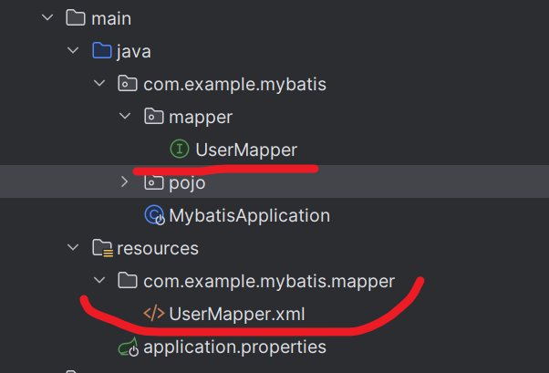

# MyBatis 笔记

## 准备工作

- 创建 SpringBoot 工程，引入 MyBatis 相关依赖
- 准备数据库表 `user`、实体类 `User`
- 配置数据库连接（`application.properties`）

示例（请用自己的账号与密码，不要把密码写进笔记仓库）：

```properties
spring.datasource.url=jdbc:mysql://localhost:3306/web01
spring.datasource.username=root
spring.datasource.password=YOUR_PASSWORD
spring.datasource.driver-class-name=com.mysql.cj.jdbc.Driver
```

## Mapper 接口（注解方式）

```java
@Mapper
public interface UserMapper {
  @Select("select * from user")
  List<User> findAll();
}
```

## 增删改查（CRUD）

### 删除

```java
@Delete("delete from user where id = #{id}")
void deleteById(Integer id);
```

### 插入

```java
@Insert("insert into user(username,password,age,name) values(#{username},#{password},#{age},#{name})")
void insert(User user);
```

### 修改

```java
@Update("update user set username=#{username},password=#{password},age=#{age},name=#{name} where id=#{id}")
void update(User user);
```

### 查询（多参数）

```java
@Select("select * from user where id=#{id} and username=#{username}")
User findByIdAndUsername(@Param("id") Integer id, @Param("username") String username);
```

## #{} 与 ${}

| 符号 | 说明 | 场景 | 优缺点 |
| --- | --- | --- | --- |
| `#{...}` | 占位符，替换为 `?`，生成预编译 SQL | 参数值传递 | 安全、性能高（推荐） |
| `${...}` | 字符串拼接 | 动态表名、字段名 | 存在 SQL 注入风险 |

## XML 映射（复杂 SQL 推荐）

规则：

1. XML 映射文件与 Mapper 接口同包同名
2. `namespace` 与 Mapper 全限定名一致
3. SQL 的 `id` 与方法名一致，返回类型匹配

```xml
<?xml version="1.0" encoding="UTF-8" ?>
<!DOCTYPE mapper
  PUBLIC "-//mybatis.org//DTD Mapper 3.0//EN"
  "http://mybatis.org/dtd/mybatis-3-mapper.dtd">
<mapper namespace="com.example.mybatis.mapper.UserMapper">
  <select id="findAll" resultType="com.example.mybatis.pojo.User">
    select * from user
  </select>
</mapper>
```

示例图：



## MyBatis-Plus（补充）

通过 Maven 导入 mybatis-plus 即可开始使用。

