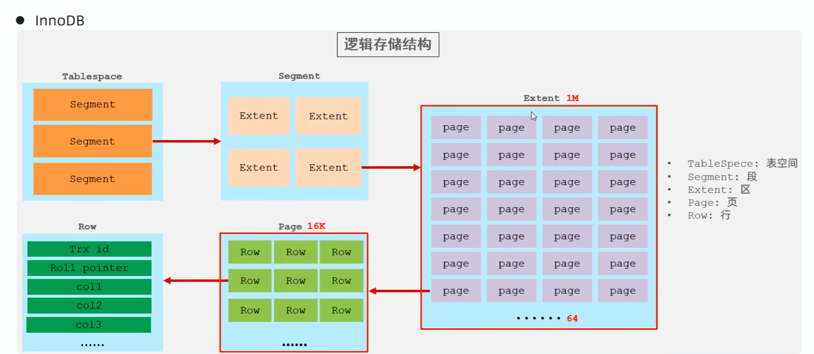
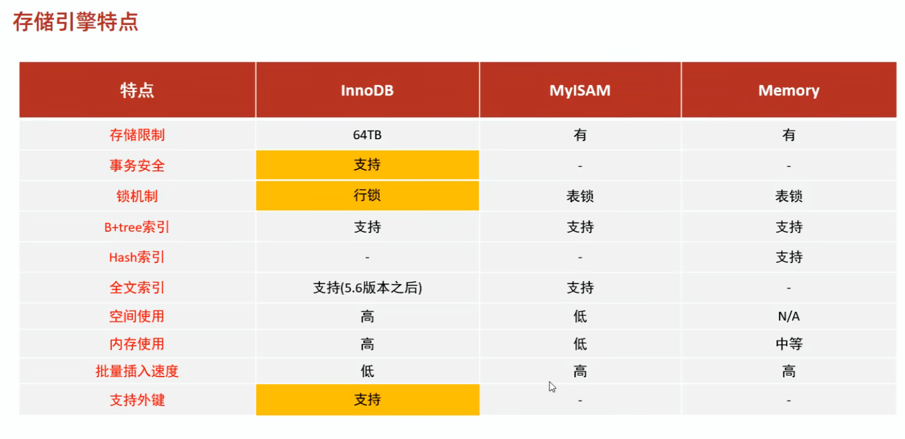

# SQL 进阶（MySQL）

## 存储引擎（InnoDB / MyISAM / Memory）

```mysql
InnoDB
  - 默认存储引擎（MySQL 5.5+）
  - 支持事务（ACID）、行级锁、外键
  - 表空间：xxx.ibd（含表结构/数据/索引，8.0 后结构信息更多在 sdi 中）

MyISAM
  - 早期默认引擎
  - 不支持事务/外键
  - 支持表锁，不支持行锁

Memory
  - 数据在内存中，适合临时表/缓存
  - 默认 Hash 索引
```





选择建议：

- 高一致性/高并发更新：InnoDB
- 读多写少、对事务要求不高：MyISAM（现在更多用 InnoDB）
- 临时/缓存：Memory（注意容量和断电丢失）

## 索引（核心概念）

索引：高效获取数据的数据结构（有序）

优势：
  - 提高检索效率，降低 IO
  - 减少排序成本，降低 CPU 消耗

劣势：
  - 占用额外空间
  - 降低写性能（insert/update/delete）

常见结构：
  - B+Tree（最常见）
  - Hash（精确匹配有效，不支持范围）
  - R-Tree（空间索引）
  - Full-text（倒排索引，全文检索）

| 常用指令                             | 作用                                                         | 用法                                                     |
| ------------------------------------ | ------------------------------------------------------------ | -------------------------------------------------------- |
| SHOW STATUS LIKE 'sort_merge_passes' | 看 `sort_merge_passes` 这个状态变量。如果数值增加了说明发生了磁盘外部排序，因为归并排序才会增加这个计数。也可以开启 `optimizer_trace`，能看到排序用了多少内存、有没有溢出。 | 执行 SQL 前后分别 `SHOW STATUS LIKE 'sort_merge_passes'` |
|                                      |                                                              |                                                          |
|                                      |                                                              |                                                          |


## 工具速记：

### EXPLAIN


| 字段            | 含义                   | 典型值 / 示例                                                | 性能提示 / 解析                           | 优化思路                       |
| --------------- | ---------------------- | ------------------------------------------------------------ | ----------------------------------------- | ------------------------------ |
| `id`            | 查询标识 / 执行顺序    | 1, 2, 3                                                      | id 越大越先执行（子查询、联合查询中顺序） | 理解子查询/联合查询顺序        |
| `select_type`   | 查询类型               | SIMPLE, PRIMARY, SUBQUERY, DERIVED, UNION                    | 判断查询是否复杂（子查询/派生表）         | 尽量避免 DERIVED/临时表        |
| `table`         | 当前访问的表           | user, order                                                  | 哪张表正在被访问                          | 确认表是否大、索引使用情况     |
| `type`          | 表访问类型（最重要）   | system, const, eq_ref, ref, range, index, ALL                | 决定查询效率；ALL 最差                    | 添加索引、改写 SQL             |
| `possible_keys` | 可能用的索引           | idx_a, idx_b                                                 | MySQL 认为可用的索引                      | 添加合适索引                   |
| `key`           | 实际使用的索引         | idx_a                                                        | 没有索引则 key=NULL → 性能差              | 确认索引被使用                 |
| `key_len`       | 使用索引的长度（字节） | 4, 8                                                         | 判断联合索引用了哪部分字段                | 确保最左前缀使用               |
| `ref`           | 索引匹配方式           | const, ref, eq_ref                                           | 表示索引用什么匹配条件                    | 判断是否唯一匹配               |
| `rows`          | 估算扫描行数           | 1000, 100000                                                 | 行数越大性能越差                          | 优化条件、索引覆盖             |
| `filtered`      | 估算过滤比例（%）      | 10, 100                                                      | rows × filtered = 实际扫描行数            | 提高过滤条件效率               |
| `Extra`         | 额外信息（关键）       | Using index, Using where, Using filesort, Using temporary, Using index condition | 解释执行计划行为                          | 优化排序、覆盖索引、避免临时表 |


| Extra 值              | 含义             | 性能   | 优化建议            |
| --------------------- | ---------------- | ------ | ------------------- |
| Using index           | 覆盖索引，不回表 | ✅ 最优 | 无需改进            |
| Using index condition | ICP，减少回表    | ✅ 很好 | 使用索引条件下推    |
| Using where           | 需要额外过滤     | ⚠️ 一般 | 改写 SQL 或索引优化 |
| Using filesort        | 需要额外排序     | ❌ 慢   | 联合索引 + 顺序一致 |
| Using temporary       | 使用临时表       | ❌ 慢   | 避免子查询 / 建索引 |

| type   | 含义              | 性能提示 |
| ------ | ----------------- | -------- |
| system | 表只有一行        | ✅ 最好   |
| const  | 主键/唯一索引查询 | ✅ 极佳   |
| eq_ref | 唯一索引匹配      | ✅ 很好   |
| ref    | 普通索引匹配      | ✅ 较好   |
| range  | 范围索引查询      | ⚠️ 一般   |
| index  | 全索引扫描        | ⚠️ 较慢   |
| ALL    | 全表扫描          | ❌ 最差   |

#### 实战口诀（EXPLAIN 看表法）

1. **key 有没有？** → 是否用索引
2. **type 是不是 ALL？** → 是否全表扫描
3. **rows 大不大？** → 扫描量
4. **Extra 有没有 filesort / temporary？** → 排序/临时表性能问题
5. **key_len** → 联合索引是否用全
6. **filtered** → 数据过滤效率
